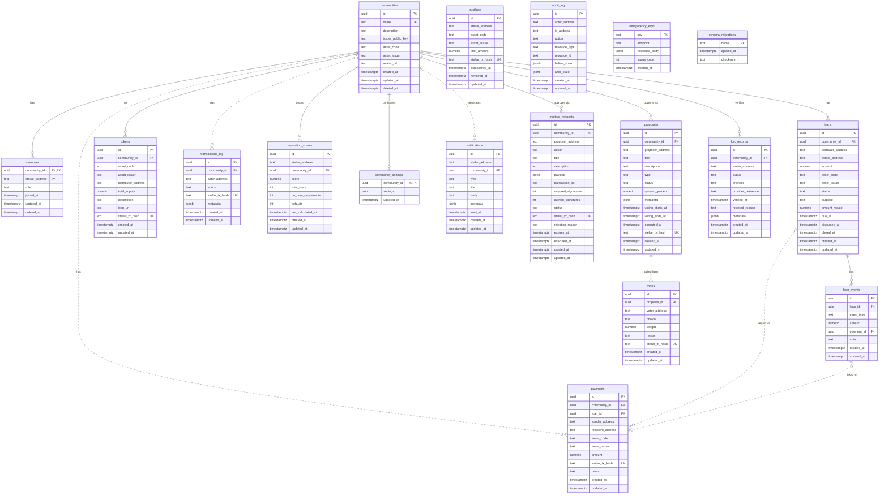

# Database Schema

PostgreSQL 16. All timestamps are `TIMESTAMPTZ` (UTC). UUIDs use `gen_random_uuid()`.

---

## ERD

This diagram reflects the final schema after every migration in
`backend/src/db/migrations/` has been applied. Tables without foreign keys
appear as standalone entities; relationship cardinality follows column
nullability and uniqueness constraints.



Cardinality markers use `||` for exactly one, `o|`/`|o` for zero or one,
and `o{`/`}o` for zero or many. For example, a payment can exist without a
community or loan, while every vote must belong to exactly one proposal.
Solid lines represent required parent-child references; dotted lines represent
nullable, non-identifying foreign keys.

---

## Migration Runner

`backend/src/db/migrate.ts` applies the SQL files in `backend/src/db/migrations/`.

| Command                           | What it does                                              |
| --------------------------------- | --------------------------------------------------------- |
| `npm run db:migrate`              | Applies every pending migration in order                  |
| `npm run db:migrate -- --dry-run` | Lists what would be applied without touching the DB       |
| `npm run db:status`               | Prints applied, pending, and drifted migrations           |
| `npm run db:rollback -- <n>`      | Runs the matching `.down.sql` for the last `n` migrations |

Rules the runner enforces:

- **Naming.** Files must be `NNN_snake_case_name.sql`; a `.down.sql` sibling is the rollback script. Anything else in the directory that ends in `.sql` aborts the run rather than being silently skipped.
- **Ordering.** Files are sorted by the numeric prefix (so `9_` runs before `10_`), with the filename as a tie-breaker when two files share a prefix.
- **Idempotence.** Each applied filename is recorded in `schema_migrations`, so a second run is a no-op.
- **Atomicity.** Every migration runs inside its own transaction and is rolled back on error, leaving `schema_migrations` untouched for that file.
- **Concurrency.** The runner holds a PostgreSQL advisory lock for the whole run, so two processes starting at once cannot apply the same file twice.
- **Drift detection.** The SHA-256 of each applied file is stored on apply and re-checked on every run. Editing a migration that has already been applied fails the run; add a new migration instead.

---

## Tables

### `schema_migrations`

Migration tracking table. One row per applied migration file.

| Column       | Type          | Notes                                                            |
| ------------ | ------------- | ---------------------------------------------------------------- |
| `name`       | `TEXT`        | PK — migration filename                                          |
| `applied_at` | `TIMESTAMPTZ` | When the migration ran                                           |
| `checksum`   | `TEXT`        | SHA-256 of the file as applied; NULL for pre-checksum migrations |

Indexes: `idx_schema_migrations_applied_at` on `applied_at` — the runner lists applied migrations with `ORDER BY applied_at ASC, name ASC`.

**Bootstrap.** `001_schema_migrations.sql` is the only definition of this table; `migrate.ts` executes that file before every run and records it as applied with `ON CONFLICT DO NOTHING`, so it never appears as pending and is never replayed. The file is fully idempotent (`CREATE TABLE IF NOT EXISTS` / `CREATE INDEX IF NOT EXISTS` / `COMMENT ON`), so running it against an already-migrated database is a no-op.

**Rollback.** `npm run db:rollback` deletes a migration's `schema_migrations` row before executing its `.down.sql`, inside one transaction. That ordering is what lets `001_schema_migrations.down.sql` drop the tracking table itself.

---

### `idempotency_keys`

Stores completed write responses by client-supplied idempotency key so a retry
can replay the original response without repeating its side effect.

| Column          | Type          | Notes                                      |
| --------------- | ------------- | ------------------------------------------ |
| `key`           | `TEXT`        | PK — value of the `Idempotency-Key` header |
| `endpoint`      | `TEXT`        | Route against which the key was used       |
| `response_body` | `JSONB`       | Original response envelope                 |
| `status_code`   | `INTEGER`     | Original HTTP status code                  |
| `created_at`    | `TIMESTAMPTZ` | Time the completed response was recorded   |

FK constraints: none. Migration 023 creates this table idempotently with
`CREATE TABLE IF NOT EXISTS`.

---

### `communities`

A registered cooperative community on CoopLumen. Each community maps to a Stellar custom asset.

| Column              | Type          | Notes                                      |
| ------------------- | ------------- | ------------------------------------------ |
| `id`                | `UUID`        | PK                                         |
| `name`              | `TEXT`        | Unique display name                        |
| `description`       | `TEXT`        | Nullable                                   |
| `issuer_public_key` | `TEXT`        | Stellar G… address that controls the asset |
| `asset_code`        | `TEXT`        | 1–12 char Stellar asset code               |
| `asset_issuer`      | `TEXT`        | Stellar G… address of the asset issuer     |
| `avatar_url`        | `TEXT`        | Nullable — community avatar image          |
| `created_at`        | `TIMESTAMPTZ` |                                            |
| `updated_at`        | `TIMESTAMPTZ` | Auto-updated by `set_updated_at()` trigger |
| `deleted_at`        | `TIMESTAMPTZ` | Nullable — soft delete                     |

FK constraints: none (root table).

CHECK constraints — these mirror the request validation in `backend/src/api/schemas/community.ts`, so rows written by seeds, migrations or manual fixes obey the same rules the API enforces:

| Constraint                            | Rule                                                                      |
| ------------------------------------- | ------------------------------------------------------------------------- |
| `communities_name_check`              | trimmed `name` is 2–64 characters                                         |
| `communities_description_check`       | `description` is NULL or ≤ 500 characters                                 |
| `communities_asset_code_check`        | `asset_code` matches `^[A-Za-z0-9]{1,12}$` (Stellar alphanum4/alphanum12) |
| `communities_issuer_public_key_check` | `issuer_public_key` matches `^G[A-Z2-7]{55}$`                             |
| `communities_asset_issuer_check`      | `asset_issuer` matches `^G[A-Z2-7]{55}$`                                  |
| `communities_avatar_url_check`        | `avatar_url` is NULL or ≤ 2048 characters                                 |

Indexes:

| Index                               | Definition                                         | Serves                                       |
| ----------------------------------- | -------------------------------------------------- | -------------------------------------------- |
| `communities_name_key`              | `UNIQUE (name)`                                    | duplicate-name 409s                          |
| `idx_communities_active_created_at` | `(created_at DESC) WHERE deleted_at IS NULL`       | default community listing                    |
| `idx_communities_asset`             | `(asset_code, asset_issuer)`                       | resolving a community from its Stellar asset |
| `idx_communities_fts`               | GIN over `to_tsvector(name \| ' ' \| description)` | full-text search                             |

Integration tests use deterministic seed fixtures from `backend/src/test/fixtures.ts` to create and tear down the baseline `EcoDAO` and `AgriCoop` records used by the HTTP suite.

---

### `members`

A Stellar address belonging to a community. Composite PK prevents duplicates — the same address can join many communities, but only once each.

| Column            | Type          | Notes                                        |
| ----------------- | ------------- | -------------------------------------------- |
| `community_id`    | `UUID`        | PK, FK → `communities(id) ON DELETE CASCADE` |
| `stellar_address` | `TEXT`        | PK — `G…` ed25519 public key, 56 chars       |
| `role`            | `TEXT`        | `admin \| treasurer \| member \| observer`   |
| `joined_at`       | `TIMESTAMPTZ` |                                              |
| `updated_at`      | `TIMESTAMPTZ` | Auto-updated by `set_updated_at()` trigger   |
| `deleted_at`      | `TIMESTAMPTZ` | Nullable — soft delete                       |

Constraints:

- `members_role_check` — `role IN ('admin', 'treasurer', 'member', 'observer')`
- `members_stellar_address_format` — `stellar_address ~ '^G[A-Z2-7]{55}$'`, mirroring the API-layer validation. Added `NOT VALID`, so it governs writes without re-validating pre-existing rows.

Indexes:

- `idx_members_stellar_address` on `stellar_address` — cross-community lookup for one address. Every other read is served by the primary key, whose leading column is `community_id`.
- `idx_members_community_active` on `(community_id, joined_at) WHERE deleted_at IS NULL` — the member list endpoint, which always filters out soft-deleted rows and orders by `joined_at`.

---

### `loans`

A P2P loan between two community members, tracked off-chain. Base columns are created in migration 002; the lifecycle columns and constraints are added in migration 015.

| Column             | Type            | Notes                                                               |
| ------------------ | --------------- | ------------------------------------------------------------------- |
| `id`               | `UUID`          | PK                                                                  |
| `community_id`     | `UUID`          | FK → `communities(id)`                                              |
| `borrower_address` | `TEXT`          | Stellar address                                                     |
| `lender_address`   | `TEXT`          | Stellar address                                                     |
| `amount`           | `NUMERIC(20,7)` | 7 decimal places — Stellar precision                                |
| `asset_code`       | `TEXT`          |                                                                     |
| `asset_issuer`     | `TEXT`          | Nullable — XLM has no issuer (migration 015)                        |
| `status`           | `TEXT`          | Default `pending`; CHECK enum (see below)                           |
| `purpose`          | `TEXT`          | Nullable — free-text loan purpose (migration 015)                   |
| `amount_repaid`    | `NUMERIC(20,7)` | Default `0`; CHECK `0 ≤ amount_repaid ≤ amount` (migration 015)     |
| `due_at`           | `TIMESTAMPTZ`   | Nullable                                                            |
| `disbursed_at`     | `TIMESTAMPTZ`   | Nullable — set when the loan is disbursed (migration 015)           |
| `closed_at`        | `TIMESTAMPTZ`   | Nullable — set when repaid, defaulted, or cancelled (migration 015) |
| `created_at`       | `TIMESTAMPTZ`   |                                                                     |
| `updated_at`       | `TIMESTAMPTZ`   | Auto-updated by `set_updated_at()` trigger (migration 015)          |

Status enum (`loans_status_check`): `pending \| active \| repaid \| defaulted \| cancelled`.

Indexes: `community_id`, `borrower_address`, `lender_address`, and `status`.

---

### `payments`

Records every submitted Stellar payment. Linked optionally to a community and/or loan.

| Column              | Type            | Notes                               |
| ------------------- | --------------- | ----------------------------------- |
| `id`                | `UUID`          | PK                                  |
| `community_id`      | `UUID`          | Nullable FK → `communities(id)`     |
| `loan_id`           | `UUID`          | Nullable FK → `loans(id)`           |
| `sender_address`    | `TEXT`          |                                     |
| `recipient_address` | `TEXT`          |                                     |
| `asset_code`        | `TEXT`          |                                     |
| `asset_issuer`      | `TEXT`          | Nullable — XLM has no issuer        |
| `amount`            | `NUMERIC(20,7)` |                                     |
| `stellar_tx_hash`   | `TEXT`          | Unique — prevents duplicate records |
| `memo`              | `TEXT`          | Nullable                            |
| `created_at`        | `TIMESTAMPTZ`   |                                     |
| `updated_at`        | `TIMESTAMPTZ`   | Auto-updated by trigger             |

---

### `trustlines`

Local cache of Stellar trustline state. Updated when `establishTrustline` / `removeTrustline` is called.

| Column            | Type            | Notes                                 |
| ----------------- | --------------- | ------------------------------------- |
| `id`              | `UUID`          | PK                                    |
| `stellar_address` | `TEXT`          |                                       |
| `asset_code`      | `TEXT`          |                                       |
| `asset_issuer`    | `TEXT`          |                                       |
| `limit_amount`    | `NUMERIC(20,7)` | Nullable                              |
| `stellar_tx_hash` | `TEXT`          | Unique                                |
| `established_at`  | `TIMESTAMPTZ`   |                                       |
| `removed_at`      | `TIMESTAMPTZ`   | Nullable — set when trustline removed |
| `updated_at`      | `TIMESTAMPTZ`   | Auto-updated by trigger               |

Unique constraint: `(stellar_address, asset_code, asset_issuer)` — one row per address/asset pair; `removed_at` tracks removal without duplicating rows.

---

### `loan_events`

Immutable audit trail of loan lifecycle transitions.

| Column       | Type            | Notes                                                      |
| ------------ | --------------- | ---------------------------------------------------------- |
| `id`         | `UUID`          | PK                                                         |
| `loan_id`    | `UUID`          | FK → `loans(id) ON DELETE CASCADE`                         |
| `event_type` | `TEXT`          | `created \| disbursed \| repayment \| closed \| defaulted` |
| `amount`     | `NUMERIC(20,7)` | Nullable — repayment amount                                |
| `payment_id` | `UUID`          | Nullable FK → `payments(id)`                               |
| `note`       | `TEXT`          | Nullable                                                   |
| `created_at` | `TIMESTAMPTZ`   |                                                            |
| `updated_at` | `TIMESTAMPTZ`   | Auto-updated by trigger                                    |

---

### `tokens`

On-chain token metadata for a community's Stellar custom asset.

| Column                | Type            | Notes                                    |
| --------------------- | --------------- | ---------------------------------------- |
| `id`                  | `UUID`          | PK                                       |
| `community_id`        | `UUID`          | FK → `communities(id) ON DELETE CASCADE` |
| `asset_code`          | `TEXT`          |                                          |
| `asset_issuer`        | `TEXT`          |                                          |
| `distributor_address` | `TEXT`          | Holds circulating supply                 |
| `total_supply`        | `NUMERIC(20,7)` | Mirrors Horizon asset stats              |
| `description`         | `TEXT`          | Nullable                                 |
| `icon_url`            | `TEXT`          | Nullable                                 |
| `stellar_tx_hash`     | `TEXT`          | Unique — issuance tx                     |
| `created_at`          | `TIMESTAMPTZ`   |                                          |
| `updated_at`          | `TIMESTAMPTZ`   | Auto-updated by trigger                  |

Unique constraint: `(asset_code, asset_issuer)` — Stellar asset identity.

---

### `transactions_log`

General-purpose audit trail for all on-chain and off-chain state changes. `metadata` JSONB holds action-specific payload.

| Column            | Type          | Notes                                   |
| ----------------- | ------------- | --------------------------------------- |
| `id`              | `UUID`        | PK                                      |
| `community_id`    | `UUID`        | Nullable FK → `communities(id)`         |
| `actor_address`   | `TEXT`        | Nullable — Stellar address of initiator |
| `action`          | `TEXT`        | Constrained enum (see migration)        |
| `stellar_tx_hash` | `TEXT`        | Unique, nullable                        |
| `metadata`        | `JSONB`       | GIN-indexed for flexible querying       |
| `created_at`      | `TIMESTAMPTZ` |                                         |
| `updated_at`      | `TIMESTAMPTZ` | Auto-updated by trigger                 |

Indexes: `(community_id, created_at DESC)` B-tree for newest-first community history queries, `actor_address`, `action`, GIN on `metadata`.

`community_id` is `ON DELETE SET NULL` (migration 017): deleting a community nulls the reference but preserves the immutable audit record.

---

### `reputation_scores`

Per-address, per-community lending reputation score (0–100).

| Column               | Type           | Notes                                    |
| -------------------- | -------------- | ---------------------------------------- |
| `id`                 | `UUID`         | PK                                       |
| `stellar_address`    | `TEXT`         |                                          |
| `community_id`       | `UUID`         | FK → `communities(id) ON DELETE CASCADE` |
| `score`              | `NUMERIC(5,2)` | 0–100, CHECK enforced. Defaults to `50`  |
| `total_loans`        | `INTEGER`      | `>= 0`, CHECK enforced                   |
| `on_time_repayments` | `INTEGER`      | `>= 0`, CHECK enforced                   |
| `defaults`           | `INTEGER`      | `>= 0`, CHECK enforced                   |
| `last_calculated_at` | `TIMESTAMPTZ`  |                                          |
| `created_at`         | `TIMESTAMPTZ`  |                                          |
| `updated_at`         | `TIMESTAMPTZ`  | Auto-updated by trigger                  |

Unique constraint: `(stellar_address, community_id)`.

The default score is the neutral midpoint the scoring formula converges on for a
member with no history (`100 * (on_time + 1) / (on_time + defaults + 2)`), so an
address that has never borrowed is not indistinguishable from a serial defaulter.

Indexes: `stellar_address`, `(community_id, score DESC)` for community leaderboards.

---

### `community_settings`

One JSON config row per community. PK is `community_id` — no extra id column needed.

| Column         | Type          | Notes                                                       |
| -------------- | ------------- | ----------------------------------------------------------- |
| `community_id` | `UUID`        | PK, FK → `communities(id) ON DELETE CASCADE`                |
| `settings`     | `JSONB`       | Free-form config (loan limits, quorum, voting period, etc.) |
| `updated_at`   | `TIMESTAMPTZ` | Auto-updated by trigger                                     |

---

### `notifications`

In-app notifications addressed to a Stellar address. `read_at` is null until the user reads it.

| Column            | Type          | Notes                                             |
| ----------------- | ------------- | ------------------------------------------------- |
| `id`              | `UUID`        | PK                                                |
| `stellar_address` | `TEXT`        | Recipient — `^G[A-Z2-7]{55}$`                     |
| `community_id`    | `UUID`        | Nullable FK → `communities(id) ON DELETE CASCADE` |
| `type`            | `TEXT`        | Constrained enum (see migration)                  |
| `title`           | `TEXT`        | Non-blank                                         |
| `body`            | `TEXT`        | Nullable                                          |
| `metadata`        | `JSONB`       | Nullable — action-specific payload                |
| `read_at`         | `TIMESTAMPTZ` | Nullable — partial index for unread queries       |
| `created_at`      | `TIMESTAMPTZ` |                                                   |
| `updated_at`      | `TIMESTAMPTZ` | Auto-updated by trigger                           |

Indexes: `(stellar_address, created_at DESC)` for the recipient feed, `community_id`, and a partial `(stellar_address, created_at DESC) WHERE read_at IS NULL` for unread counts and the unread feed.

Constraints: `notifications_type_check` on `type`, `notifications_stellar_address_format` on the recipient address, `notifications_read_at_check` (`read_at IS NULL OR read_at >= created_at`), and `notifications_title_check` (title is not blank). The last three are `NOT VALID`, so they apply to new and updated rows and leave any pre-existing row untouched.

---

### `audit_log`

Security-sensitive event log. Records before/after state for all destructive operations. Never truncated.

| Column          | Type          | Notes                                    |
| --------------- | ------------- | ---------------------------------------- |
| `id`            | `UUID`        | PK                                       |
| `actor_address` | `TEXT`        | Nullable — Stellar address or system     |
| `ip_address`    | `TEXT`        | Nullable                                 |
| `action`        | `TEXT`        | e.g. `community.delete`, `member.remove` |
| `resource_type` | `TEXT`        | e.g. `community`, `member`, `loan`       |
| `resource_id`   | `TEXT`        | UUID or other identifier                 |
| `before_state`  | `JSONB`       | Nullable — snapshot before change        |
| `after_state`   | `JSONB`       | Nullable — snapshot after change         |
| `created_at`    | `TIMESTAMPTZ` |                                          |
| `updated_at`    | `TIMESTAMPTZ` | Auto-updated by trigger                  |

---

### `multisig_requests`

A treasury action awaiting co-signer approval. The row is the off-chain coordination record — it holds the proposed Stellar transaction envelope while signatures are collected. The network remains the authority on whether that envelope is actually executable.

Dormant until the multisig phase activates it.

| Column                | Type          | Notes                                                                                           |
| --------------------- | ------------- | ----------------------------------------------------------------------------------------------- |
| `id`                  | `UUID`        | PK                                                                                              |
| `community_id`        | `UUID`        | FK → `communities(id) ON DELETE CASCADE`                                                        |
| `proposer_address`    | `TEXT`        | Stellar address that opened the request                                                         |
| `action`              | `TEXT`        | `payment \| token_issue \| trustline \| settings_update \| member_role_change \| signer_update` |
| `title`               | `TEXT`        | Short human-readable summary                                                                    |
| `description`         | `TEXT`        | Nullable — rationale shown to co-signers                                                        |
| `payload`             | `JSONB`       | Action-specific parameters. GIN-indexed                                                         |
| `transaction_xdr`     | `TEXT`        | Nullable — base64 Stellar transaction envelope, unsigned or partially signed                    |
| `required_signatures` | `INTEGER`     | `>= 1` — threshold in force when the request was opened                                         |
| `current_signatures`  | `INTEGER`     | `0 .. required_signatures`                                                                      |
| `status`              | `TEXT`        | `pending \| approved \| rejected \| executed \| expired \| cancelled`                           |
| `stellar_tx_hash`     | `TEXT`        | Unique, nullable — set on execution                                                             |
| `rejection_reason`    | `TEXT`        | Nullable                                                                                        |
| `expires_at`          | `TIMESTAMPTZ` | Nullable — partial index drives the expiry sweep                                                |
| `executed_at`         | `TIMESTAMPTZ` | Nullable — non-null only when `status = 'executed'`                                             |
| `created_at`          | `TIMESTAMPTZ` |                                                                                                 |
| `updated_at`          | `TIMESTAMPTZ` | Auto-updated by trigger                                                                         |

Only an executed request carries an on-chain result: `status = 'executed'` requires both `executed_at` and `stellar_tx_hash`, and every other status requires `executed_at` to be null.

Indexes: `(community_id, status, created_at DESC)`, `proposer_address`, partial on `expires_at` where the request is still pending, GIN on `payload`.

---

### `proposals`

Governance proposals raised inside a community. Created in Phase 3 prep and dormant until the
governance phase activates it — no API reads or writes it yet.

| Column             | Type           | Notes                                                                             |
| ------------------ | -------------- | --------------------------------------------------------------------------------- |
| `id`               | `UUID`         | PK                                                                                |
| `community_id`     | `UUID`         | FK → `communities(id) ON DELETE CASCADE`                                          |
| `proposer_address` | `TEXT`         | Stellar address of the author, `^G[A-Z2-7]{55}$` CHECK enforced                   |
| `title`            | `TEXT`         | Non-blank, max 200 chars, CHECK enforced                                          |
| `description`      | `TEXT`         | Nullable — proposal body, max 10 000 chars                                        |
| `type`             | `TEXT`         | Constrained enum (see migration)                                                  |
| `status`           | `TEXT`         | `draft`, `active`, `passed`, `rejected`, `executed`, `cancelled`                  |
| `quorum_percent`   | `NUMERIC(5,2)` | 0–100, CHECK enforced — share of voting weight needed to pass                     |
| `metadata`         | `JSONB`        | Nullable — type-specific payload (target loan, spend amount, etc.)                |
| `voting_starts_at` | `TIMESTAMPTZ`  | Defaults to insert time                                                           |
| `voting_ends_at`   | `TIMESTAMPTZ`  | Must be later than `voting_starts_at`, CHECK enforced                             |
| `executed_at`      | `TIMESTAMPTZ`  | Nullable — only on a `passed`/`executed` proposal, at or after `voting_starts_at` |
| `stellar_tx_hash`  | `TEXT`         | Unique, nullable — execution transaction                                          |
| `created_at`       | `TIMESTAMPTZ`  |                                                                                   |
| `updated_at`       | `TIMESTAMPTZ`  | Auto-updated by trigger                                                           |

Indexes: `community_id`, `proposer_address`, `(community_id, status)`, and a partial index on
`voting_ends_at` covering only `status = 'active'` for open-ballot sweeps.

---

### `votes`

Ballots cast against a proposal. One row per voter per proposal — a voter changing their mind
updates the existing row rather than inserting a second one. Dormant until the governance phase
activates it.

| Column            | Type            | Notes                                                          |
| ----------------- | --------------- | -------------------------------------------------------------- |
| `id`              | `UUID`          | PK                                                             |
| `proposal_id`     | `UUID`          | FK → `proposals(id) ON DELETE CASCADE`                         |
| `voter_address`   | `TEXT`          | Stellar address of the voter, `^G[A-Z2-7]{55}$` CHECK enforced |
| `choice`          | `TEXT`          | `for`, `against`, or `abstain`                                 |
| `weight`          | `NUMERIC(20,7)` | Voting weight, `0 … 1e12` CHECK enforced — defaults to `1`     |
| `reason`          | `TEXT`          | Nullable — optional rationale, max 2 000 chars                 |
| `stellar_tx_hash` | `TEXT`          | Unique, nullable — on-chain vote transaction                   |
| `created_at`      | `TIMESTAMPTZ`   |                                                                |
| `updated_at`      | `TIMESTAMPTZ`   | Auto-updated by trigger — reflects the last change of mind     |

Unique constraint: `(proposal_id, voter_address)`.

Indexes: `proposal_id`, `voter_address`, `(proposal_id, choice)` for tallying.

---

### `kyc_records`

Per-community KYC verification state for a Stellar address. **Phase 4 prep** — dormant until SEP-12 anchor integration activates it; no API routes read or write this table yet.

| Column               | Type          | Notes                                                                                        |
| -------------------- | ------------- | -------------------------------------------------------------------------------------------- |
| `id`                 | `UUID`        | PK                                                                                           |
| `community_id`       | `UUID`        | FK → `communities(id) ON DELETE CASCADE`                                                     |
| `stellar_address`    | `TEXT`        |                                                                                              |
| `status`             | `TEXT`        | `pending \| submitted \| verified \| rejected \| expired`, CHECK enforced, default `pending` |
| `provider`           | `TEXT`        | Nullable — SEP-12 anchor / KYC provider identifier                                           |
| `provider_reference` | `TEXT`        | Nullable — external reference ID from the provider                                           |
| `verified_at`        | `TIMESTAMPTZ` | Nullable — set when `status` becomes `verified`                                              |
| `rejected_reason`    | `TEXT`        | Nullable                                                                                     |
| `metadata`           | `JSONB`       | Nullable — provider-specific payload                                                         |
| `created_at`         | `TIMESTAMPTZ` |                                                                                              |
| `updated_at`         | `TIMESTAMPTZ` | Auto-updated by trigger                                                                      |

Unique constraint: `(community_id, stellar_address)` — one KYC record per address per community.

---

## Foreign Key `ON DELETE` Summary

| Child table          | FK column      | References        | Behaviour               |
| -------------------- | -------------- | ----------------- | ----------------------- |
| `members`            | `community_id` | `communities(id)` | CASCADE                 |
| `loans`              | `community_id` | `communities(id)` | CASCADE (migration 019) |
| `payments`           | `community_id` | `communities(id)` | SET NULL (nullable)     |
| `payments`           | `loan_id`      | `loans(id)`       | SET NULL (nullable)     |
| `trustlines`         | —              | —                 | standalone              |
| `loan_events`        | `loan_id`      | `loans(id)`       | CASCADE                 |
| `loan_events`        | `payment_id`   | `payments(id)`    | SET NULL (nullable)     |
| `tokens`             | `community_id` | `communities(id)` | CASCADE                 |
| `transactions_log`   | `community_id` | `communities(id)` | SET NULL (nullable)     |
| `reputation_scores`  | `community_id` | `communities(id)` | CASCADE                 |
| `community_settings` | `community_id` | `communities(id)` | CASCADE                 |
| `notifications`      | `community_id` | `communities(id)` | CASCADE                 |
| `multisig_requests`  | `community_id` | `communities(id)` | CASCADE                 |
| `proposals`          | `community_id` | `communities(id)` | CASCADE                 |
| `votes`              | `proposal_id`  | `proposals(id)`   | CASCADE                 |
| `kyc_records`        | `community_id` | `communities(id)` | CASCADE                 |

### ON DELETE Behavior Design Rationale

**CASCADE** (most common): Used for dependent entities that have no meaning without their parent.

- **Examples**: `members`, `loans`, `tokens`, `reputation_scores`, `community_settings`
- **Rationale**: These entities are intrinsically tied to their parent community. If a community is deleted, its members, loans, tokens, reputation scores, and settings should also be removed to maintain data consistency.

**SET NULL**: Used for audit trails and immutable records that should survive parent deletion.

- **Examples**: `transactions_log`, `payments.community_id`, `payments.loan_id`, `loan_events.payment_id`
- **Rationale**: Audit records should be preserved for compliance and historical analysis. Setting the foreign key to NULL preserves the immutable record while breaking the relationship with the deleted parent.

**RESTRICT/NO ACTION**: Not used in this schema (all foreign keys have explicit behaviors).

- **Rationale**: Default PostgreSQL behavior prevents accidental data loss but requires explicit design decisions for each relationship.

### Connection Pooling Guidelines

**PostgreSQL Connection Pool (backend/src/db/index.ts)**:

- **PGPOOL_MAX=10**: Default pool size suitable for most applications. Increase for high-traffic production.
- **PGPOOL_IDLE_TIMEOUT=30000**: 30 seconds idle timeout prevents connection accumulation.
- **PGPOOL_CONNECTION_TIMEOUT=2000**: 2 second connection timeout ensures quick failure for unavailable databases.

**PgBouncer (docker-compose.yml)**:

- **PGBOUNCER_POOL_MODE=transaction**: Transaction pooling for maximum connection reuse.
- **PGBOUNCER_MAX_CLIENT_CONN=100**: Maximum client connections through PgBouncer.
- **PGBOUNCER_DEFAULT_POOL_SIZE=20**: Default pool size per database.

### Backup Strategy

**Automated Backups (`scripts/db/backup-db.sh`)**:

- **Format**: PostgreSQL custom format (`-Fc`) for efficient compression and selective restore.
- **Retention**: Keeps 10 most recent backups, automatically prunes older ones.
- **Scheduling**: Recommended to run daily via cron or CI/CD pipeline.

**Restore Procedure**:

```bash
# Restore from backup
pg_restore --clean --if-exists --dbname=cooplumen backups/cooplumen_YYYYMMDDTHHMMSSZ.dump

# Verify restore
psql -d cooplumen -c "SELECT COUNT(*) FROM schema_migrations;"
```
